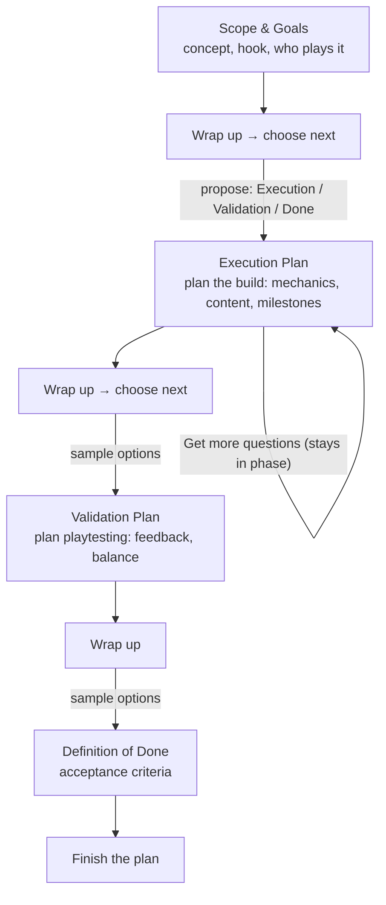
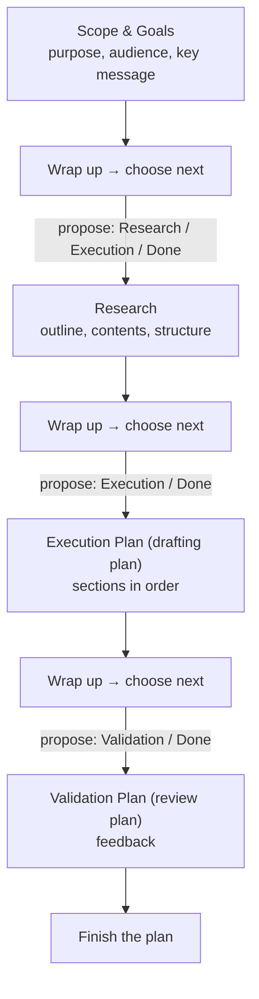
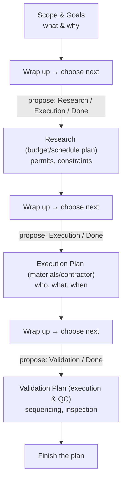

# Project Flows (draft research doc) — evolved into "Guided Phases"

Status: **draft / living** — owned by the Phase 2.8 "Research & define the phase
library + wrap-up flow" item in IMPLEMENTATION-PLAN.md. Everything here is a
working model to validate, not the final design.

## One-line change of direction

A project is **not assigned a flow**. Instead, planning advances through
**phases** — labeled planning foci — one wrap-up at a time. At each wrap-up the
app offers a couple of **"what's next?" phase buttons** (plus "Finish the plan")
and the user nudges themselves into the next phase they think is appropriate.
The **QuestionGenerator proposes** those next phases: the hardcoded generator
text-searches the round's answers and synopsis; the LLM (Phase 3) picks from a
list based on what it reads.

## Why phases instead of flows?

Flows were rigid: pick a category at creation and the whole journey is dictated
thereafter. Real projects don't behave. A **phase** is small — a labeled focus
with a question pool (hardcoded) or prompt template (LLM) and a done condition.
Offering a next-phase choice at each wrap-up keeps the user in control while the
generator steers using the just-answered round. The "flows" we sketched earlier
survive only as *illustrative trajectories* — shapes projects tend to land on
naturally, not constraints.

## The tool plans; it doesn't execute

Alpha Thinker plans *for* building, producing, validating, and finalizing — it
never does those things itself. So every phase is named after the **planning
deliverable** it produces, not the act: not "Build" but **Execution Plan** (a
plan of milestones/tasks a team could follow), not "Playtest" but
**Validation Plan** (a plan of what to test and how to judge it), not
"Finalize" but **Definition of Done** (the plan for accepting and shipping).
The actual building happens after the user closes the app.

## Mechanics (invariant, applies everywhere)

- Rounds remain the on-disk units; wrap-up closes a round and opens the next.
- A round records the **phase** it belongs to (`Round.phase`).
- The planning "stage" is just the current round's phase. A numeric glance
  ("Phase 3 of 7") is a *derived* index into the phase library's ordering —
  never stored.
- **No flow/category is enforced on a project.** Wrap-up **always advances to a
  new phase** — it shows 2–3 adjacent next-phase choices proposed by the
  generator + a "Finish the plan" option; the user picks. No automatic round
  completion.
- A phase can **span multiple rounds** via "Get more questions", which starts a
  new `UserRequested` round in the current phase (e.g. several questions rounds
  refining the execution plan) — not via wrap-up.
- Schema: `Round` carries `phase` and `origin` (`Initial` / `UserRequested`;
  `FollowUp` reserved for future phase-revisit). `Initial` = the opening round
  of a phase (project start or a wrap-up advancing); `UserRequested` = the user
  tapped "Get more questions". There is no `Project.flow` column.
- The generator's done signal = offering **"Finish the plan"** (whether because
  the phase's pool is exhausted, the LLM says done, or simply as an always-list
  option). "Get more questions" disables itself when the current phase's pool
  is exhausted.

## Wrap-up: the phase-choice mechanism

At wrap-up, the generator reads the round's completed answers and proposes the
**next phase** as a few adjacent options (never the current phase — staying in
the current phase is done via "Get more questions"):

- **Hardcoded generator:** **text-search** — score each phase's keyword profile
  against the round's answers + the synopsis; offer the top 2–3 matches
  (deduped against already-visited phases).
- **LLM (Phase 3):** **pick from the list** — read the accumulated Q&A and
  select the best next phase(s) from the library (optionally naming a new one
  when confident).
- **User:** tap a proposed phase, re-roll ("something else?"), or pick
  **"Finish the plan"** (synthesis/done).
- The generator then produces the first round (`origin: Initial`) of the chosen
  phase.

## Illustrative trajectories (what tends to emerge — not enforced)

The earlier "flow" charts, demoted to common trajectories the phase library
should be able to express:

1. **Game-ish** — deep and iterative: scope → design → execution plan (possibly
   several planning rounds) → validation plan → definition of done.
2. **Document-ish** — short and linear: purpose/audience → outline/content →
   drafting plan → review plan → definition of done.
3. **Home-improvement-ish** — constraint-driven: scope → budget/permits →
   materials/contractor planning → execution & QC plan.

### Game-ish trajectory

### Document-ish trajectory

### Home-improvement-ish trajectory

Note how all three are just different *orderings and repeats* over a shared set
of phases — exactly why the mechanism doesn't need a forced flow.

## Choosing the next phase (how a suggestion is made)

Two layers:

1. **The generator proposes.** Hardcoded = keyword scoring (below); LLM = pick
   from the library / free-form label. Default-highlight the top-rated option.
2. **The user decides.** Tap the proposed phase, re-roll the suggestions, or
   "Finish the plan". (With the LLM on, "ask for something else" may justify a
   free-text field later.)

### What feeds the suggestion (inputs)

Which 1–3 phase names appear after a wrap-up is driven by three signals:

- **Current high-level phase** — where the project is now; defines the
  *reachable* next phases (adjacency, never the current phase itself).
- **Prior picked phases (history)** — the trajectory so far (e.g. alternated
  Design ⇄ Build, or a Research phase deepened via "Get more questions");
  avoids re-offering exhausted/visited phases at wrap-up.
- **Current project status** — how many questions are answered / ignored vs
  open, per-phase pool state (exhausted?), and any done/maturity signal from the
  generator. A nearly-done phase surfaces "Finish the plan" higher.

The picked phase is persisted per round (`Round.phase`), which *is* the history
input; the suggestion only needs read access to current round + prior rounds.

### Labels are internal

Phase names in the library are canonical fixtures the app reasons with
(e.g. "Execution Plan", "Validation Plan"). User-facing naming is a
presentation concern and can drift from the internal label (the hope is they
mostly match, but nothing forbids friendlier copy).

## Hardcoded phase recommendation (sketch)

Each phase is a **planning deliverable**, so each gets a small keyword profile
and pool, e.g.:

- **Scope & Goals:** problem, user, goal, vision, why
- **Research:** benchmark, competitor, reference, inspiration, similar
- **Design:** feature, design, prototype, workflow, value proposition
- **Execution Plan:** build, implement, backlog, milestone, technical, resource,
  timeline
- **Validation Plan:** trial, feedback, test, measure, risk
- **Definition of Done:** finish, launch, ship, publish, review, deliverable,
  done

`recommendNextPhase(synopsis, answeredQuestions)` scores weighted keyword hits
across the synopsis + committed answers, extends to top N candidates, and
returns them for the wrap-up chooser. This is the `HardcodedQuestionGenerator`
slice of Phase 2.8.

## Open questions

- How many phases in the initial library? Start with ~6 above plus a
  user-created fallback; grow on evidence.
- Should the LLM propose brand-new phase labels, or only pick from the library?
  (Hybrid: pick from the library; allow new labels when confident.)
- Fixed buttons vs. free-text next-phase prompting? Buttons for v1; free text
  only if "something else" proves worth it.
- Where does the user's **global question pool** (Phase 4) attach — projects or
  phases? (Lean: phases — interleave the phase pool with globals.)
- When does "Finish the plan" get auto-suggested first? (When the chosen phase's
  pool is exhausted or the generator reports done.)
- Numeric stage display: keep the derived library index ("Phase 3 of 7") or show
  labels only? (Lean: label + optional index.)