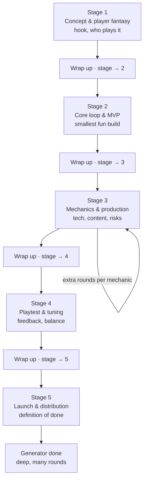
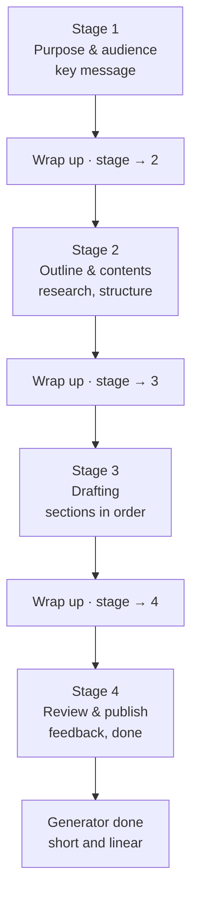
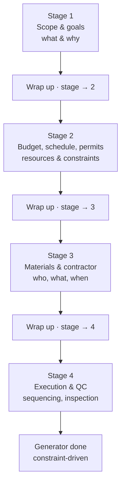

# Project Flows (draft research doc)

Status: **draft / living** — owned by the Phase 2.8 "Research & define stage
progression by project type" item in IMPLEMENTATION-PLAN.md. Everything here is a
hypothesis to validate, not the final model.

## Why flows?

Rounds and stages are generic, but different *kinds* of projects plan
differently. A game, a written report, and a home renovation don't share one
shape — they differ in how many rounds to expect, what each stage's questions
should focus on, and how planning "ends". A **flow** is a category-specific stage
progression that tells the generator (hardcoded pools today, the LLM later) what
to ask and when to report done.

## Mechanics (invariant, applies to every flow)

- Rounds are the on-disk units; wrap-up closes a round and opens the next.
- The planning stage is **derived**: `count of completed rounds + 1` (never stored).
- Wrap-up is **manual and intentional** — there is no automatic round completion.
- The selected flow decides stage count/depth and the per-stage question focus.

## Candidate flows (hypotheses)

Three flows to start with — enough to prove the mechanism without over-modeling:

1. **Game** — deep and iterative: concept, core-loop/MVP, production (with extra
   rounds per mechanic), playtest/tuning, then launch.
2. **Document / report** — short and linear: purpose/audience, outline/content,
   drafting, review/publish.
3. **Home improvement** — constraint-driven: scope/goals, budget/schedule/permits,
   materials/contractor, execution/QC.

### Game

### Document / report

### Home improvement

## Choosing a flow (how do we determine which one?)

Options, roughly increasing in complexity:

1. **Manual pick at project creation** — the user taps a flow chip (Game /
   Document / Home improvement / General). Simple, reliable, but adds friction at
   the moment of first use.
2. **Lightweight synopsis heuristics** — keyword/structure hints (e.g. "game",
   "quest", "level" → Game; "report", "thesis", "memo", "outline" → Document;
   "remodel", "renovate", "kitchen", "deck" → Home improvement). Anything that
   doesn't match falls back to a **General** flow. Cheap, offline, rough.
3. **Intelligent classification (Phase 3)** — the LLM/embedding picks or suggests
   the flow from the synopsis and can re-suggest as content evolves.

Recommended starting point: a **General default** plus a small keyword detector,
keeping the result user-overridable, until real use proves which calls are wrong.
That said, (1) forces a choice up front and (2) makes wrong calls to fix — the
point of this research task is to settle the tradeoff against the hardcoded pools
that already need per-stage partitioning.

## Open questions

- Which categories actually "matter" enough to justify their own flow? Start with
  three (above) and grow only on evidence.
- Where does the flow live — a persisted `Project.category` (editable) or derived
  each time? Persisted is likely needed: wrap-up enablement and pool selection
  need a stable answer.
- Can the user change a project's flow mid-journey? (Probably not once past stage
  1, or at least it should be expensive.)
- Does "done" differ per flow beyond pool exhaustion? Yes — see the charts:
  launch / publish / QC each have their own definition of done.
- How do per-category pools interact with the user's **global question pool**
  (Phase 4)? Globals likely interleave into whatever flow is active.