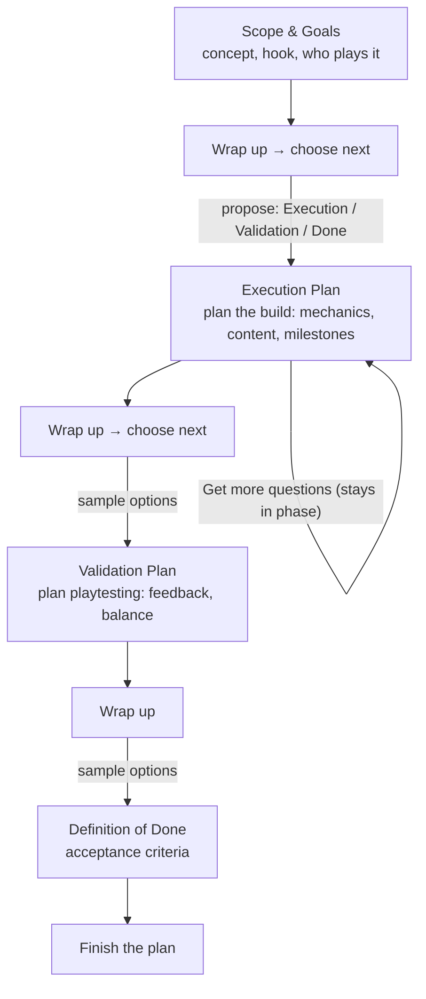
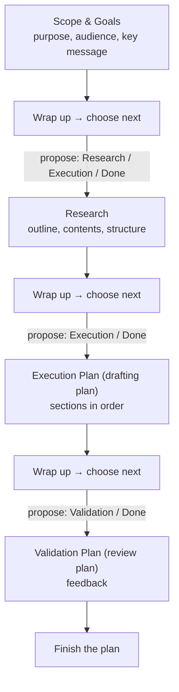
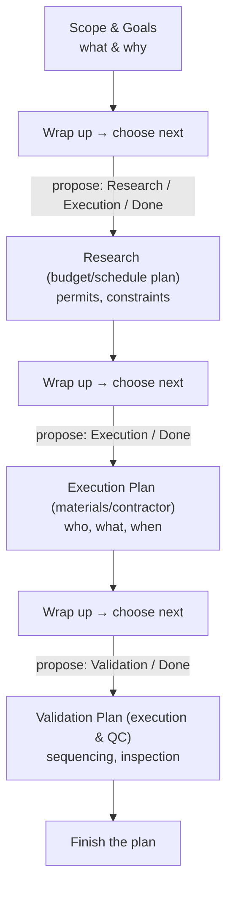

# Project Flows (draft research doc) — evolved into "Guided Phases"

Status: **living** — owned by the Phase 2.8 "Research & define the phase
library + wrap-up flow" item in IMPLEMENTATION-PLAN.md. The phase **library** is
settled (six phases, per-phase pools); the pool **partition notes** below are
working content to validate while rebalancing `HardcodedQuestionGenerator`.

## One-line change of direction

A project is **not assigned a flow**. Instead, planning advances through
**phases** — labeled planning foci — one wrap-up at a time. At each wrap-up the
app offers a couple of **"what's next?" phase buttons** (plus "Finish the plan")
and the user nudges themselves into the next phase they think is appropriate.
The **QuestionGenerator proposes** those next phases: the hardcoded generator
text-searches the round's answers and synopsis; the LLM (Phase 3) picks from a
list based on what it reads.

## Why phases instead of flows?

Flows were rigid: pick a category at creation and the whole journey is dictated
thereafter. Real projects don't behave. A **phase** is small — a labeled focus
with a question pool (hardcoded) or prompt template (LLM) and a done condition.
Offering a next-phase choice at each wrap-up keeps the user in control while the
generator steers using the just-answered round. The "flows" we sketched earlier
survive only as *illustrative trajectories* — shapes projects tend to land on
naturally, not constraints.

## The tool plans; it doesn't execute

Alpha Thinker plans *for* building, producing, validating, and finalizing — it
never does those things itself. So every phase is named after the **planning
deliverable** it produces, not the act: not "Build" but **Execution Plan** (a
plan of milestones/tasks a team could follow), not "Playtest" but
**Validation Plan** (a plan of what to test and how to judge it), not
"Finalize" but **Definition of Done** (the plan for accepting and shipping).
The actual building happens after the user closes the app.

## Mechanics (invariant, applies everywhere)

- Rounds remain the on-disk units; wrap-up closes a round and opens the next.
- A round records the **phase** it belongs to (`Round.phase`). The current
  planning "stage" is read from the round in progress (`Round.phase`), with a
  fresh project starting at the library's first phase. Storing the phase on the
  round is the current approach — it may later become a column on the project
  if that reads better; that's an implementation detail, not a design
  invariant. A numeric glance ("Phase 3 of 7") is a *derived* index into the
  phase library's ordering rather than a stored field.
- **No flow/category is enforced on a project.** Wrap-up **always advances to a
  new phase** — it shows 2–3 adjacent next-phase choices proposed by the
  generator + a "Finish the plan" option; the user picks. No automatic round
  completion.
- A phase can **span multiple rounds** via "Get more questions", which starts a
  new `UserRequested` round in the current phase (e.g. several questions rounds
  refining the execution plan) — not via wrap-up.
- Schema: `Round` carries `phase` and `origin` (`Initial` / `UserRequested`;
  `FollowUp` reserved for future phase-revisit). `Initial` = the opening round
  of a phase (project start or a wrap-up advancing); `UserRequested` = the user
  tapped "Get more questions". There is no `Project.flow` column.
- The generator's done signal = offering **"Finish the plan"** (whether because
  the phase's pool is exhausted, the LLM says done, or simply as an always-list
  option). "Get more questions" disables itself when the current phase's pool
  is exhausted.

## Wrap-up: the phase-choice mechanism

At wrap-up, the generator reads the round's completed answers and proposes the
**next phase** as a few adjacent options (never the current phase — staying in
the current phase is done via "Get more questions"):

- **Hardcoded generator:** **sequential order** — the immediate successor of
  the current phase leads, then the project's unvisited phases fill the rest
  (see "Choosing the next phase" below). Keyword text-scoring was tried and
  retired (the signal is too weak on a short Q&A corpus); the deterministic
  rule matches where these phase library's trajectories tend to go.
- **LLM (Phase 3):** **pick from the list** — read the accumulated Q&A and
  select the best next phase(s) from the library (optionally naming a new one
  when confident).
- **User:** tap a proposed phase, re-roll ("something else?"), or pick
  **"Finish the plan"** (synthesis/done).
- The generator then produces the first round (`origin: Initial`) of the chosen
  phase.

## Illustrative trajectories (what tends to emerge — not enforced)

The earlier "flow" charts, demoted to common trajectories the phase library
should be able to express:

1. **Game-ish** — deep and iterative: scope → design → execution plan (possibly
   several planning rounds) → validation plan → definition of done.
2. **Document-ish** — short and linear: purpose/audience → outline/content →
   drafting plan → review plan → definition of done.
3. **Home-improvement-ish** — constraint-driven: scope → budget/permits →
   materials/contractor planning → execution & QC plan.

### Game-ish trajectory

### Document-ish trajectory

### Home-improvement-ish trajectory

Note how all three are just different *orderings and repeats* over a shared set
of phases — exactly why the mechanism doesn't need a forced flow.

## Choosing the next phase (how a suggestion is made)

Two layers:

1. **The generator proposes.** Hardcoded = the library's sequential order;
   LLM = pick from the library / free-form label. Default-highlight the
   top-rated option.
2. **The user decides.** Tap the proposed phase, re-roll the suggestions, or
   "Finish the plan". (With the LLM on, "ask for something else" may justify a
   free-text field later.)

### What feeds the suggestion (inputs)

Which 1–3 phase names appear after a wrap-up is driven by three signals:

- **Current high-level phase** — where the project is now; defines the
  *reachable* next phases (adjacency, never the current phase itself).
- **Prior picked phases (history)** — the trajectory so far (e.g. alternated
  Design ⇄ Build, or a Research phase deepened via "Get more questions");
  avoids re-offering exhausted/visited phases at wrap-up.
- **Current project status** — how many questions are answered / ignored vs
  open, per-phase pool state (exhausted?), and any done/maturity signal from the
  generator. A nearly-done phase surfaces "Finish the plan" higher.

The picked phase is persisted per round (`Round.phase`), which *is* the history
input; the suggestion only needs read access to current round + prior rounds.

### Labels are internal

Phase names in the library are canonical fixtures the app reasons with
(e.g. "Execution Plan", "Validation Plan"). User-facing naming is a
presentation concern and can drift from the internal label (the hope is they
mostly match, but nothing forbids friendlier copy).

## The phase library (settled — Phase 2.8)

Decision record for the IMPLEMENTATION-PLAN.md:142-144 "settle the starting
phase set" item. A code-defined `Phase` enum in `commonMain` (the `phases`
package) defines the phases (stable string key, display label, ordering index,
per-phase question pool); `Round.phase` stores the enum,
persisted as its stable **key** string. A persisted `phases` table is
**deferred** until user-created/LLM-proposed labels arrive — a later migration
is trivial because the key already is the reference.

**Settled: six domain-neutral phases, no genre taxonomy.** Domain flavor lives
in per-phase question-pool content — never in extra phase labels. The wrap-up
chooser (2-3 options + "Finish the plan") is the only phase surface a user ever
meets; keeping the library small and stable is what keeps cognitive load low
while the pools keep questions relevant.

| Key | Label | v1 pool |
|---|---|---|
| `scope-goals` | Scope & Goals | 12 (from 21, deduped) |
| `research` | Research | ~10 (4 + ~6 new) |
| `design` | Design | ~12 (8 + ~4 new) |
| `execution-plan` | Execution Plan | ~14 (from 20, deduped) |
| `validation-plan` | Validation Plan | ~10 (7 + ~3 new) |
| `definition-of-done` | Definition of Done | ~10 (6 + ~4 new) |

"Finish the plan" is the terminal option, not a seventh phase.

### Pool serving + exhaustion

- Each phase owns a slice of the pool; the **front holds the highest-value
  questions**. The phase's initial round serves the front (~7); each
  `UserRequested` round continues where the last one stopped (~5). Target depth
  of ~10-14 per phase supports an initial round plus 1-2 "Get more questions"
  rounds before exhaustion lands.
- **Exhaustion is per-phase**: once every question in the phase's pool has been
  asked, "Get more questions" disables and **"Finish the plan" surfaces first**
  in the wrap-up chooser. This is the phase-level stand-in for the Phase 3
  explicit done signal — exhaustion is never inferred from an empty generation
  result (an `emptyList()` today is indistinguishable from "nothing surfaced
  yet").
- Next-phase suggestions follow the **sequential rule**: the immediate
  successor of the current phase in the library ordering always leads (even if
  previously visited), then the remaining slots fill with the project's
  *unvisited* phases — so a skipped phase stays reachable. This replaces an
  earlier plan of weighted keyword scoring across the synopsis + committed
  answers (`recommendNextPhase`): with ~6 keywords per phase and only a few
  hundred words of input, the hits were mostly ties and phrasing noise, and
  Phase 3's LLM (which reads the answers) supersedes it. Default-highlight the
  first suggestion.

### Pool partition (existing `questionPool` → phase)

Working notes for re-partitioning `HardcodedQuestionGenerator.questionPool`.
Target total ≈ today's pool size (~66) — rebalancing, not growth. Questions are
listed in the priority order to serve within their phase; "(dedupe)" marks
candidates to retire or reword rather than carry forward; "(draft)" marks new
genre-flavored questions to add (game / document / home-improvement shapes per
the trajectories below).

**scope-goals** (keep 12):
- "What is the primary problem this project solves?"
- "Who is the ideal user or beneficiary?"
- "What is the single most important goal?"
- "What is the \"Minimum Viable Product\" (MVP) version?"
- "What's the core value proposition?"
- "What is the biggest constraint?"
- "What does success look like?"
- "What is the long-term vision for this project?"
- "Who are the primary stakeholders and decision-makers?"
- "What assumptions are you making?"
- "What's the scope you're comfortable with?"
- "What's out of scope right now?"

(dedupe — drop or reword): "What's the minimum viable product?" (dup of MVP);
"What are the long-term goals?" (dup of long-term vision); "What's the simplest
version that still works?" and "What's the simplest version of your answer?"
(overlap with MVP / scope); "Who else cares about this project?" and "Who else
benefits from this besides the main user?" (dup of stakeholders); "What's the
learning goal for your users?" and "How would your first user describe what this
does?" (design/pitch-leaning); "How would you explain this to a teammate?" (low
value).

**research** (4 existing + ~6 draft): "What similar projects or competitors have
you looked at?"; "What makes your approach different?"; "Are there any existing
solutions you're inspired by?"; "What's the most surprising thing about your
users?"
- (draft) "What have others already learned in this space that you can borrow?"
- (draft) "What's the proven playbook or pattern that fits this kind of
  project?" — game → comparable games; doc → similar docs; home → similar
  renovations.
- (draft) "What do existing solutions do badly that you could improve on?"
- (draft) "Where would an expert tell you not to reinvent the wheel?"
- (draft) "What's the fastest way to sanity-check this idea before building
  anything?"
- (draft) "Who is already solving this for a slightly different audience?"

**design** (8 existing + ~4 draft): "What are the key features?"; "What are the
non-negotiable features or qualities?"; "What's the one thing that must just
work?"; "What's the core workflow?"; "What data flows through the system?";
"What would the user do after using this?"; "What makes this stick in someone's
mind?"; "What's one feature you're excited about?"
- (draft) "What does the first version look like — the shape, not the polish?"
- (draft) "What's the hook that makes a first-time user sit up?" — game → core
  fantasy; doc → opening angle; home → design intent.
- (draft) "What's the part you'll iterate on most?"
- (draft) "What's the smallest demo that shows the core idea moving?"

**execution-plan** (keep 14): "What is the very first step you need to take?";
"What are three key milestones for the first month?"; "What is the target
completion date?"; "What's the estimated timeline?"; "What's the quickest path
to value?"; "What could you build in a week?"; "What resources (time, money,
tools) are currently available?"; "What resources are still needed?"; "What is
the estimated total budget?"; "What are the key technical constraints or
requirements?"; "What technologies would you like to use?"; "What's the fallback
if everything breaks?"; "Where will you cut corners to ship faster?"; "What can
wait until later?"

(dedupe/relocate): "What resources do you need?" (dup of "still needed"); "What
needs to be done first?" (dup of "very first step"); "What skills or knowledge
gaps exist?" (research-leaning); "What's the most boring but necessary part?"
(low value); "What's the hardest part to build?" (design/estimation-leaning);
"How will this project be maintained or supported later?" (candidate for
definition-of-done).

**validation-plan** (7 existing + ~3 draft): "What are the top three risks to
success?"; "What could go wrong?"; "Are there any legal, ethical, or compliance
factors?"; "How will you measure progress?"; "What feedback will you gather?";
"Who's the first person you'll show this to?"; "What's your biggest technical
risk?" (candidate dedupe against "top three risks").
- (draft) "What would convince a skeptic this works?"
- (draft) "What's the smallest test that proves the core idea?"
- (draft) "What would you measure to know it's good, not just done?"

**definition-of-done** (6 existing + ~4 draft): "How will you know if the
project is successful?"; "How will you know you're done?"; "What milestones
define completion?"; "What will you promote or distribute the final result?";
"What's your go-to-market story?"; "What's the story you'll tell at the end?"
- (draft) "What has to be true before you call it shipped?"
- (draft) "What's the final deliverable a teammate could pick up and use?"
- (draft) "What does \"done\" explicitly not include?"
- (draft) "Who signs off on done?"

## Open questions

- ~~How many phases in the initial library?~~ **Settled:** the six above;
  "Finish the plan" is terminal, not a phase. User-created/LLM-proposed labels
  are deferred to when a persisted `phases` table lands (Phase 3 LLM).
- Should the LLM propose brand-new phase labels, or only pick from the library?
  (Hybrid: pick from the library; allow new labels when confident.)
- Fixed buttons vs. free-text next-phase prompting? Buttons for v1; free text
  only if "something else" proves worth it.
- Where does the user's **global question pool** (Phase 4) attach — projects or
  phases? (Lean: phases — interleave the phase pool with globals.)
- ~~When does "Finish the plan" get auto-suggested first?~~ **Partially
  settled:** always listed in the wrap-up chooser; it surfaces first when the
  current phase's pool is exhausted. The Phase 3 LLM done signal may surface it
  earlier.
- Numeric stage display: keep the derived library index ("Phase 3 of 7") or show
  labels only? (Lean: label + optional index.)